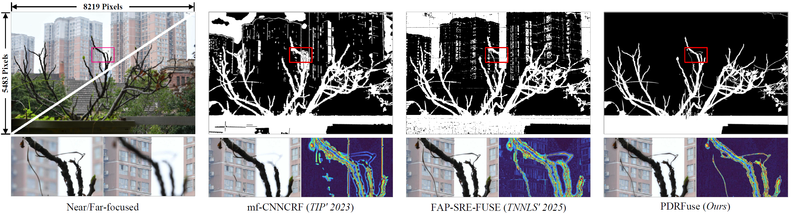
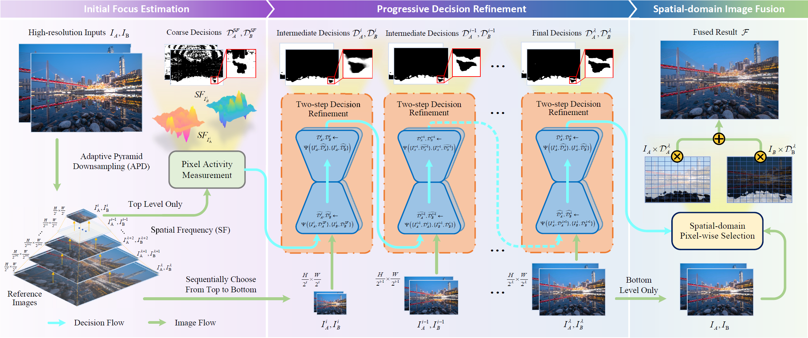
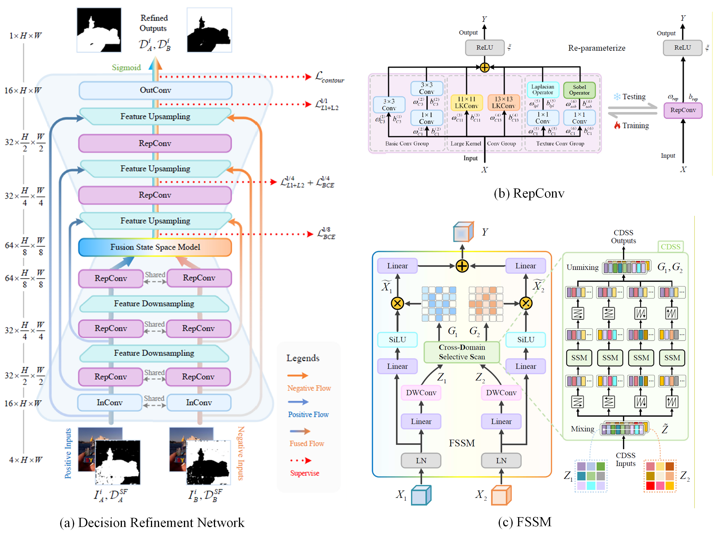
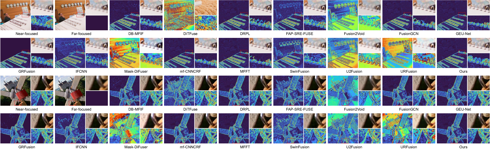
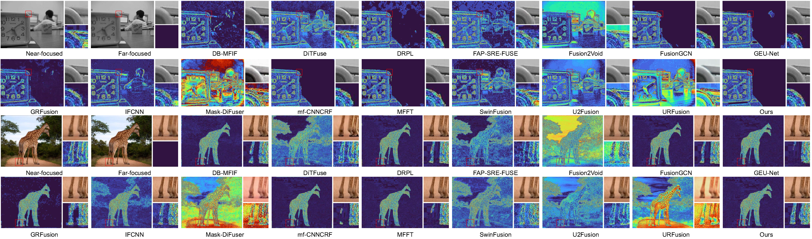
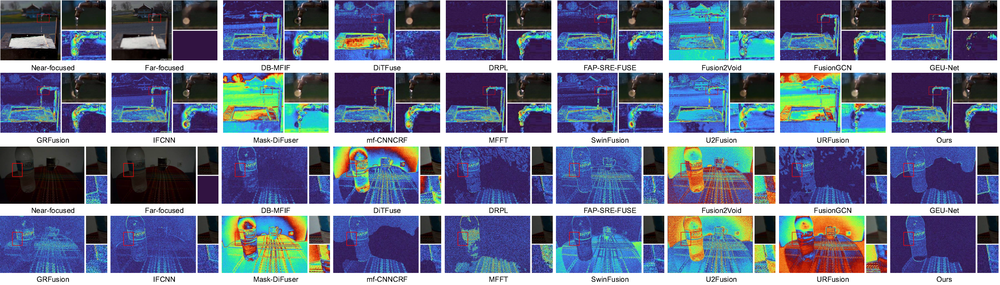
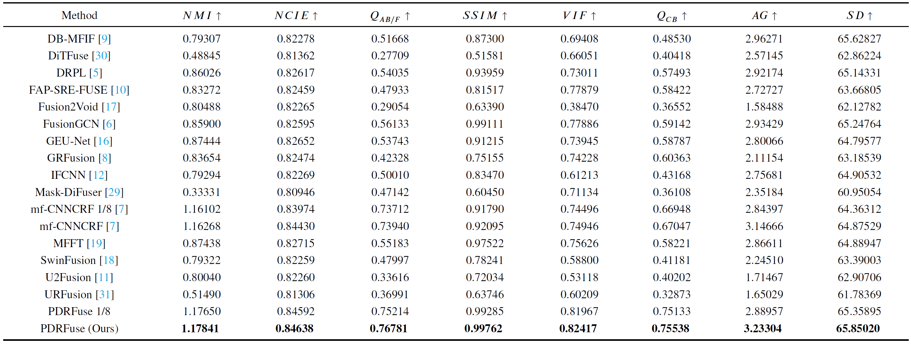
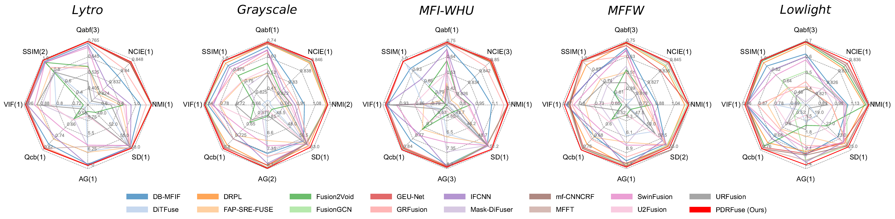
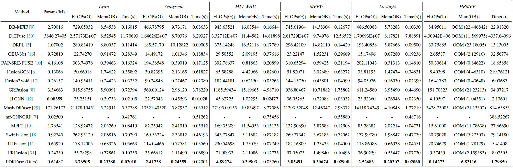

<div align="center">
    <h1>
        PDRFuse
    </h1>
    <h3>
        Official implementation of progressive decision refinement for high-resolution multi-focus image fusion
    </h3>
</div>
<br>


## 🔬 Method Overview

### Introduction

<div align="center">
  
</div>

**Fig.1.** An illustration of multi-focus image fusion in high-resolution scenarios. 

Existing deep learning-based multi-focus image fusion solutions are typically designed and implemented at obsolete low resolutions.
Nowadays, the increasing resolution of modern imaging sensors makes real-world applications more challenging due to the large train-test resolution discrepancy and the massive computational consumption at high resolutions.
To address these problems, this paper proposes a progressive decision refinement method for high-resolution multi-focus image fusion, termed PDRFuse.
In the methodology, we replace the traditional focus-property detection with coarse decision refinement, which is insensitive to resolution variations.
Decision refinement is applied progressively across multiple resolution levels to bridge the resolution gap between training and testing, thereby enabling high-resolution image fusion even with low-resolution training.
To effectively manage high-resolution inputs while minimizing computational consumption, we devise a decision refinement network that integrates structural re-parameterization with the state-space model.
The network decouples the training and testing processes through re-parameterization and uses the fusion state-space model to fuse valuable features with linear complexity, ensuring better compatibility in high-resolution applications.
In the experiment, we develop a high-resolution test dataset to give more persuasive evaluations of the proposed method and other prospective works.
Both qualitative and quantitative analyses demonstrate that our method yields high-quality fusion results, outperforming fifteen state-of-the-art methods in fusion performance and efficiency, particularly in high-resolution scenarios.

### Overall Strategy

<div align="center">
  
</div>

**Fig.2.** The overall strategy of the proposed method.
The high-resolution inputs $I_A, I_B$ are first processed into coarse decisions $\mathcal{D}_A^{SF}, \mathcal{D}_B^{SF}$ and $i$ reference images in initial focus estimation.
Then, $\mathcal{D}_A^{SF}, \mathcal{D}_B^{SF}$ will be refined into $\mathcal{D}_A^{\lambda}, \mathcal{D}_B^{\lambda}$ through $i$ two-step decision refinement.
Finally, $\mathcal{D}_A^{\lambda}, \mathcal{D}_B^{\lambda}$ are used to yield high-quality fusion results $\mathcal{F}$ in spatial-domain image fusion.

### Network Design

<div align="center">
  
</div>

**Fig.3.** Detailed Network design of the proposed method.
(a) Pipeline of the proposed decision refinement network.
The feature size of each layer is marked on the left.
(b) Schematic diagram of the re-parameterized convolutions (RepConv).
(c) Flow chart of the fusion state-space model (FSSM).

## 🔧 Installation

### Pre-implemented dependencies

The code is built on the pre-implemented selective can.\
If you are running on the Windows OS, a local compilation of selective cans is needed.\
For troubleshooting, the installation guide of [Vmamba](https://github.com/MzeroMiko/VMamba) is recommended.

### Environment

-   python == 3.10.13
-   CUDA == 12.1
-   cuDNN == 8.9.4
-   Pytorch == 2.1.2

### Requirements
```
einops==0.8.0
fvcore==0.1.5.post20221221
numpy==1.26.3
opencv_python==4.10.0.84
Pillow==10.2.0
selective_scan==0.0.2
timm==0.4.12
torch==2.1.2+cu121
torchvision==0.16.2+cu121
tqdm==4.67.0
triton==2.0.0
```


### File Tree

```
${PROJECT_ROOT}
    └── train.py # The script for network training.
    └── inference.py # The script for obtaining fusion results.
    └── requirements.txt # The dependencies list.
    ├── trained_weights # The folder contains the pre-trained weights we provided to run the model.
        └── 2024-10-17 14.36.04 # The folder, where the weights are placed.
            └── cuda_chk.txt # Training Logs.
            └── model_S66.ckpt # The pre-trained weights.
    ├── readme_figs # The folder contains the figures for the README document.
    ├── nets # The package contains the network components.
        └── ETB.py # The implementation of the re-parameterized convolutions (RepConv) in training.
        └── repETB.py # The implementation of the re-parameterized convolutions (RepConv) in testing.
        └── FSSM.py # The implementation of the fusion state-space model (FSSM).
        └── PDRF.py # The implementation of the decision refinement network backbone.
    ├── nets # The package contains some helper classes.
        └── dataloader.py # The dataloader helpers.
        └── general.py # The image processing helpers.
        └── make_up_datasets_lensblur.py # The training data builder.
        └── metrics_compute.py # The traing loss helpers.
        └── sobel_op.py # The implementation of the sobel operator.

```

## 🔥 Train

#### Step1: Data preparation
Run the multi-focus dataset creation script.

```shell
python ./misc/make_up_datasets_lensblur.py
```

The training data structure is as follows:

```
${DATASET_ROOT}
    ├── train
        ├── decisionmap
            └── 0001.png
            └── 0002.png
            └── ...
        ├── groundtruth
            └── 0001.png
            └── 0002.png
            └── ...
        ├── sourceA
            └── 0001.png
            └── 0002.png
            └── ...
        ├── sourceB
            └── 0001.png
            └── 0002.png
            └── ...
```

#### Step2: Start Training
Once the training data is ready, simply run the training script to begin training. 
Specific hyperparameters can be adjusted in train.py.
```shell
python train.py
```

## 🎯 Test
Put the checkpoint in the `./trained_weights` (We have already done).

```shell
python inference.py
```

The test dataset needs to meet the following structure:

```
${DATASET_ROOT}
    ├── SourceA
        └── 0001.png
        └── 0002.png
        └── ...
    ├── SourceA
        └── 0001.png
        └── 0002.png
        └── ...
```
You can put test datasets in the `./test_datasets` folder.\
The new high-resolution HRMFF dataset is available **[here](https://github.com/zwy0913/HRMFF)**.

## 📊 Results

### Visual

<div align="center">
  
</div>

**Fig.4.** Visual comparison of fusion results for different MFF methods on the samples No.5 and No.10 in **_HRMFF_**.

<div align="center">
  
</div>

**Fig.5.** Visual comparison of fusion results for different MFF methods on the samples No.6 and No.8 in **_HRMFF_**.

<div align="center">
  
</div>

**Fig.6.** Visual comparison of fusion results for different MFF methods on **_Lytro_**.

<div align="center">
  
</div>

**Fig.7.** Visual comparison of fusion results for different MFF methods on **_Grayscale_** and **_MFI-WHU_**.

<div align="center">
  
</div>

**Fig.8.** Visual comparison of fusion results for different MFF methods on **_MFFW_** and **_Lowlight_**.

### Metrics

<div align="center">
  
</div>

**Fig.9.** Quantitative comparison of different methods on **_HRMFF_**. The best result is marked in **bold**.

<div align="center">
  
</div>

**Fig.10.** Quantitative comparison of different MFF methods on five traditional low-resolution datasets.
    Each result reports the average evaluation score across all images in the test datasets.
    The ranks of the proposed methods are shown behind each metric name.

### Efficiency

<div align="center">
  
</div>

**Fig.11.** Efficiency comparison of different methods on six test datasets.
    For the **_HRMFF_** dataset, except for mf-CNNCRF and our method, others are evaluated using 1/8 image patching.
    The best result is marked in **bold**.

## 📄 Citation

The paper {Progressive decision refinement for high-resolution multi-focus image fusion} is currently under review.


